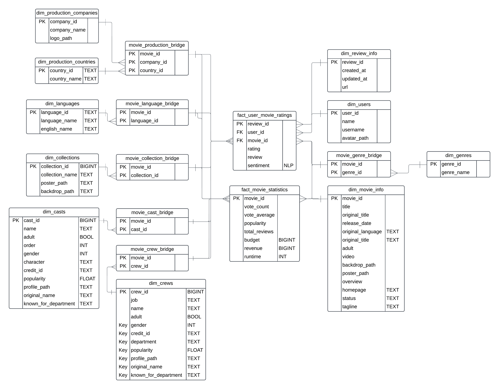
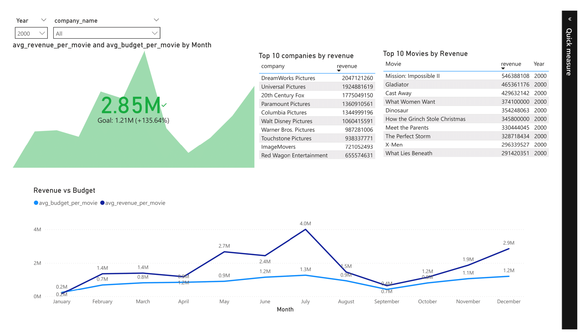

# 🎬 Full-Stack Movie Recommendation & Analytics Platform


This project showcases an end-to-end data engineering pipeline integrated with a full-stack web application. It demonstrates data ingestion, transformation, analytics, and machine learning, all within a Netflix-like platform where users can browse movies, add favorites, and provide ratings & reviews.

## 🚀 Features


### 🎭 Full-Stack Application

    Frontend: React-based UI similar to Netflix
    Backend: Django REST API to serve movie data
    User Features: Sign up, browse movies, add favorites, leave ratings & reviews

### 🏗️ Data Engineering & ETL Pipeline

    Data Source: Ingests data from TMDB API
    Storage: Raw data stored in PostgreSQL (staging layer)
    Transformation: Uses dbt to transform raw data into a star schema
    Analytics: Data is visualized using Power BI
    Machine Learning (Planned): Data will be used for movie recommendations



### ⚡ Technical Stack
| Component | Technology Used |
| -- | -- |
| Frontend |	React (Netflix-like UI) |
| Backend |	Django (REST API) |
| Database |	PostgreSQL (Staging & Star Schema) |
| ETL Pipeline |	Apache Airflow |
| Transformations |	dbt (Data Build Tool) |
| Analytics |	Power BI |
| Deployment |	Docker Compose |


## 🔀 Data Flow: From TMDB API to Power BI

### 1️⃣ Extract:

    Fetch movie IDs released in a specific monthly range from TMDB API
    Load detailed movie info, credits (cast & crew), reviews

### 2️⃣ Load (ELT Approach):

    Store raw data in PostgreSQL staging tables

### 3️⃣ Transform:

    Use dbt incremental models to build a star schema
    Prevents high compute costs (e.g., past mistake of wasting $300 GCP credits!)

### 4️⃣ Analytics & Visualization:

    Power BI imports transformed data for reporting & insights
    Imported instead of DirectQuery for performance reasons

### 5️⃣ Machine Learning (Future Work):

    Use the historical user ratings to train a recommendation model

## 🔥 Power BI Dashboards





## 🛠️ Setup Instructions
### 1️⃣ Run the Full Project
```bash
docker compose up --build -d
```
To stop:
```bash
docker compose down
```

### 2️⃣ Connect Power BI to PostgreSQL

    Server: localhost
    Port: 5432
    Database: movie_db


### 🏆 Why This Project?

✅ Demonstrates Full-Stack + Data Engineering + Analytics
✅ Uses best practices like incremental ELT
✅ Prevents costly mistakes (e.g., unnecessary full reloading)
✅ Showcases skills in Power BI & ML
